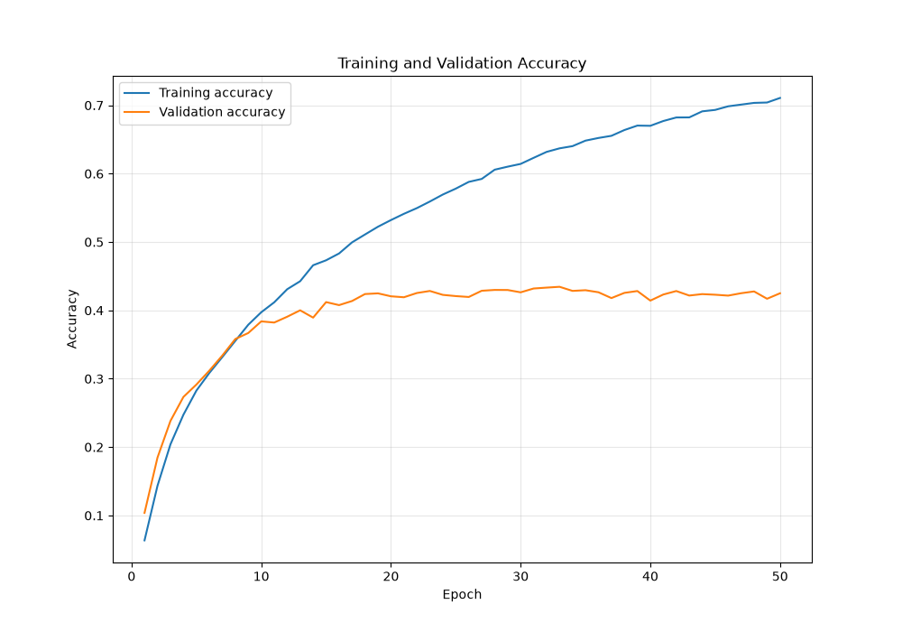
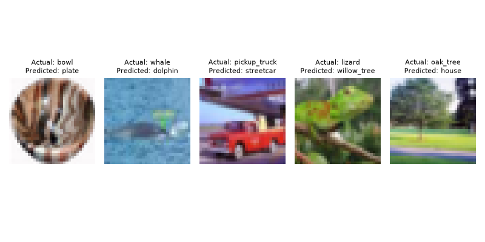
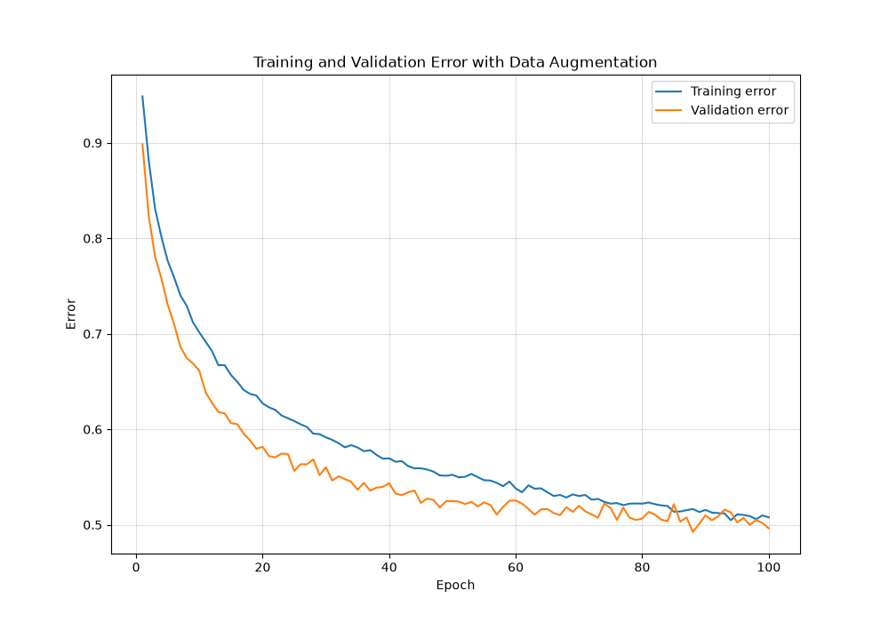
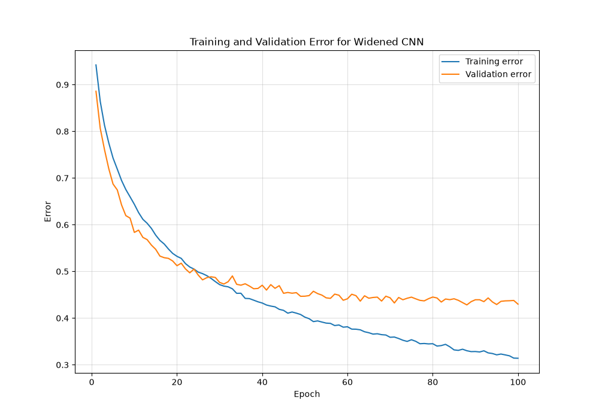
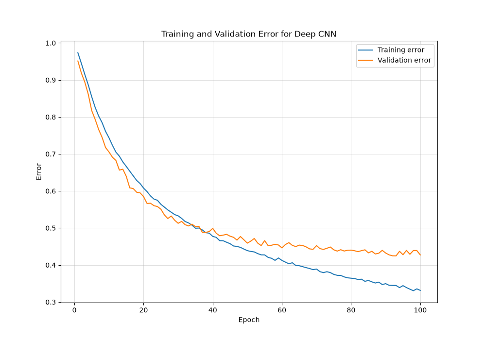
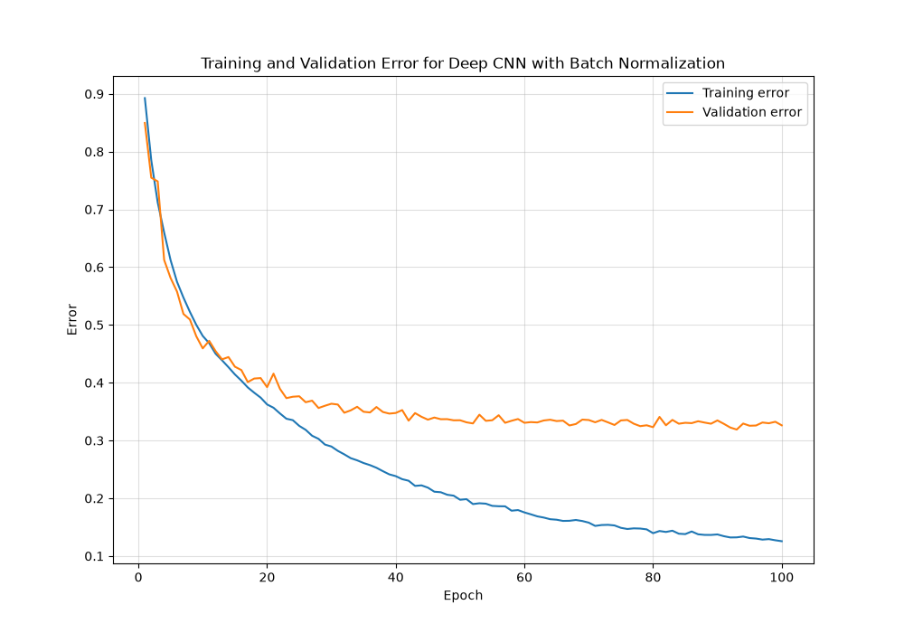
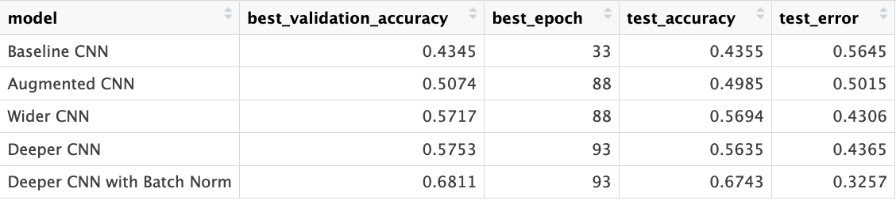

For this problem you may elect to create a quarto markdown notebook or google colab. I recommend google colab with the free pro account for students and creating a GPU/TPU runtime. [\[Lab 10 from ISLP\]](https://github.com/intro-stat-learning/ISLP_labs/blob/stable/Ch10-deeplearning-lab.ipynb) provides an excellent starting point for this lab.

Look for the part of the code where the [\[CIFAR100\]](https://www.cs.toronto.edu/~kriz/cifar.html) is loaded and used to train a basic CNN. There will be some updates to the code that you need to make to make it work on `colab`. I will release a vignette during the week which adapts the ISLP code to `colab` and shows some of the techniques required to train using GPUs on that site.

If you are working in google colab, I recommend having a separate "work" notebook where you code and work out the problems, and at the end organize all code carefully for the final submitted notebook. It is easy for notebooks to have problems because of the potential for non-ordered execution of code chunks. Submit a pdf version of your colab notebook and a link.

# Overview:

The [\[ISLP lab example from chapter 10\]](https://github.com/intro-stat-learning/ISLP_labs/blob/stable/Ch10-deeplearning-lab.ipynb) used a shallow CNN consisting of 4 blocks of a paired of convolutional and max-pooling layer. Each block halves the spatial resolution but increases the number of channels, from the 3 input color channels to 32, 64, 128, and then 256. After the 4 blocks, there is a small multilayer perceptron that performs the final classification. This network flattens the output, performs dropout for regularization, and then has one layer of ReLU that reduces from 1024 to 512, and then a final layer which reduces those 512 inputs to 100 logit weights, each corresponding to a CIFAR100 image class, for the final classification. This architecture achieved an accuracy of 44% on the test-set, which is impressive given the large number of categories but well below the accuracy achiveable given the best methods. In the following problems you will modify the architecture, hyperparameters, and the training data in order to see how much you can improve the classification accuracy.

```{python}
#| label: setup
#| code-fold: true
#| code-summary: "Packages Used"

import numpy as np
import pandas as pd
import matplotlib.pyplot as plt
import torch
from torch import nn
from torch.optim import Adam
from torch.utils.data import DataLoader, random_split, Subset
from torchvision.datasets import CIFAR100
from torchvision import transforms
from sklearn.metrics import accuracy_score
import copy
```

## Problem 1: Assessing the Original Fit

### (a)

Copy the relevant code from the ISLP notebook and adapt it to colab if you are using colab. Load CIFAR100. Train the network for 50 epochs, holding out 20% for at each epoch.

Report the validation set accuracy for the the training step where the validation accuracy is highest. Calculate the test-set accuracy of the best model, but do not look at it (save it to a variable for comparison at the end).

Plot the training and validation accuracy at each epoch, do you see evidence of overfitting?

------------------------------------------------------------------------

The relevant code begins from chunk 49 of the ISLP notebook:

```{python}
#| eval: False
#| echo: True

(cifar_train, 
cifar_test)= [CIFAR100(root="data",
                         train=train,
                         download=True)
             for train in [True, False]]
```

------------------------------------------------------------------------

::: {#card .card .text-white .bg-secondary .mb-3}
This notebook encountered an SSL error while being processed on a docker instance of RStudio. To work around this, the CIFAR100 data was downloaded locally, so the `download` argument was set to `False`.
:::

```{python}
#-- setting seed for reproducibility--
torch.manual_seed(646)
np.random.seed(646)
```

```{python}
#--Rescaling to pixel values in load--
plain_transform= transforms.Compose([transforms.ToTensor()])

#-- Load Data-- 
cifar_train= CIFAR100(root="data", train=True, download=True, transform=plain_transform)
cifar_test= CIFAR100(root="data", train=False, download=True, transform=plain_transform)

#--we'll definitely need this--
class_names= cifar_train.classes
```

#### Test Split

We'll hold out 20% for each of the 50 epochs using PyTorch manually.

```{python}

n_total= len(cifar_train)
n_train= int(0.8 * n_total)
n_valid= n_total - n_train

split_generator= torch.Generator().manual_seed(646)

#-- all row #-- 
all_indices= torch.randperm(n_total, generator=split_generator)

#-- row # to training and validation-- 
training= all_indices[:n_train]
validation= all_indices[n_train:]

#-- actual train and validation--
train_data= Subset(cifar_train, training)
valid_data= Subset(cifar_train, validation)
```

#### Data Loaders

Next we'll create the data loaders. The vignette uses `SimpleDataModule()` from the ISLP package, but we'll do the same manually.

```{python}

train_loader= DataLoader(train_data, batch_size= 128, shuffle= True)
valid_loader= DataLoader(valid_data, batch_size= 128, shuffle= False)
test_loader= DataLoader(cifar_test, batch_size= 128, shuffle= False)
```

```{python}
#| echo: False
#| eval: True

#-- Adding this chunk from the future to save render runtime-- pls ignore--
#--saved histories--
history1= pd.read_csv("history1_baseline.csv")
history2= pd.read_csv("history2_augmented.csv")
history3= pd.read_csv("history3_wide.csv")
history4= pd.read_csv("history4_deep.csv")
history5= pd.read_csv("history5_deep_bn.csv")

#--validation results--
val_results= pd.read_csv("val_results_baseline.csv")

#--final results--
final_results= pd.read_csv("final_results.csv")

#--using the model names as row labels--
results_lookup= final_results.set_index("model")

#--baseline--
acc= results_lookup.loc["Baseline CNN", "test_accuracy"]
err= results_lookup.loc["Baseline CNN", "test_error"]
top_accuracy= results_lookup.loc["Baseline CNN", "best_validation_accuracy"]
top_epoch= results_lookup.loc["Baseline CNN", "best_epoch"]

#--augmented--
acc2= results_lookup.loc["Augmented CNN", "test_accuracy"]
err2= results_lookup.loc["Augmented CNN", "test_error"]
top_accuracy2= results_lookup.loc["Augmented CNN", "best_validation_accuracy"]
top_epoch2= results_lookup.loc["Augmented CNN", "best_epoch"]

#--wide--
acc3= results_lookup.loc["Wider CNN", "test_accuracy"]
err3= results_lookup.loc["Wider CNN", "test_error"]
top_accuracy3= results_lookup.loc["Wider CNN", "best_validation_accuracy"]
top_epoch3= results_lookup.loc["Wider CNN", "best_epoch"]

#--deep--
acc4= results_lookup.loc["Deeper CNN", "test_accuracy"]
err4= results_lookup.loc["Deeper CNN", "test_error"]
top_accuracy4= results_lookup.loc["Deeper CNN", "best_validation_accuracy"]
top_epoch4= results_lookup.loc["Deeper CNN", "best_epoch"]

#--deep with batch norm--
acc5= results_lookup.loc["Deeper CNN with Batch Norm", "test_accuracy"]
err5= results_lookup.loc["Deeper CNN with Batch Norm", "test_error"]
top_accuracy5= results_lookup.loc["Deeper CNN with Batch Norm", "best_validation_accuracy"]
top_epoch5= results_lookup.loc["Deeper CNN with Batch Norm", "best_epoch"]

#-------------------------------------------- 

```

We'll test to make sure the `DataLoader()` worked:

```{python}
for X_batch, y_batch in train_loader:
  print("X:", X_batch.shape)
  print("y:", y_batch.shape)
  break
```

Like the vignette, we'll look at some of the training images:

```{python}
plt.figure(figsize=(8, 4))

for i in range(6):
    image, label= train_data[i]
    image= image.permute(1, 2, 0)
    plt.subplot(2, 3, i + 1)
    plt.imshow(image)
    plt.title(class_names[label])
    plt.axis("off")

plt.tight_layout()
plt.show()
```

#### Define CNN

Next we define a module and a manual training loop to mirror the trainer from PyTorch Lightning used in the vignette.

```{python}
#| echo: True
#| eval: True
#-- CNN building block (vignette chunk 54)--
class BuildingBlock(nn.Module):

    def __init__(self, in_channels, out_channels):
        super(BuildingBlock, self).__init__()

        self.conv= nn.Conv2d(
            in_channels=in_channels,
            out_channels=out_channels,
            kernel_size=(3, 3),
            padding="same"
        )

        self.activation= nn.ReLU()

        self.pool= nn.MaxPool2d(
            kernel_size=(2, 2)
        )

    def forward(self, x):
        x= self.conv(x)
        x= self.activation(x)
        x= self.pool(x)

        return x
```

```{python}
#| echo: True
#| eval: True
#-- Baseline CNN--
class CIFARModel(nn.Module):

    def __init__(self):
        super(CIFARModel, self).__init__()

        #-- channel changes-- 
        self.conv= nn.Sequential(
            BuildingBlock(3, 32),
            BuildingBlock(32, 64),
            BuildingBlock(64, 128),
            BuildingBlock(128, 256)
            )

        self.output= nn.Sequential(
            nn.Dropout(0.5),
            nn.Linear(2 * 2 * 256, 512),
            nn.ReLU(),
            nn.Linear(512, 100)
            )

    def forward(self, x):
        x= self.conv(x)
        x= torch.flatten(x, start_dim=1)
        x= self.output(x)

        return x
```

#### Train: Baseline CNN

We'll check the output shape is correct before running through the 50 epochs. We already tested the input shape earlier after the loader.

{fig-align="center"}

```{python}
device= "cpu"
```

```{python}
#| echo: True
#| eval: False
m1= CIFARModel().to(device)

#-- test--
for X_batch, y_batch in train_loader:
    X_batch= X_batch.to(device)

    logits= m1(X_batch)

    print(logits.shape)
    break
```

Now we'll move on to the training by creating one loop to handle all the things that should happen. The loop should train the CNN model with 50 epochs, evaluate it after each epoch, and keep track of the performances.

```{python}
#| echo: True
#| eval: False
#| code-fold: True
#-- Loss to determine "wrongness"--
loss_fn= nn.CrossEntropyLoss()
#-- optimizer... to update model-- 
optimizer= Adam(m1.parameters(), lr=0.001)

#-- results container for epochs--
history= []
#-- tracking top--
top_accuracy= 0
top_epoch= 0
antm= copy.deepcopy(m1.state_dict())

#-- training for 50 epochs--
for epoch in range(50):
#-- Training step--
    m1.train()

    train_true= []
    train_preds= []
    train_loss_total= 0
    #-- batch by batch
    for X_batch, y_batch in train_loader:

        X_batch= X_batch.to(device)
        y_batch= y_batch.to(device)
        #-- clearing gradients to avoid PyTorch default accumulation--
        optimizer.zero_grad()
        #-- passing through CNN--
        logits= m1(X_batch)
        #-- calculating loss--
        loss= loss_fn(logits, y_batch)
        #-- calculating gradients just incase change is needed--
        loss.backward()
        #-- model weights--
        optimizer.step()
        #-- selecting highest score--
        preds= logits.argmax(dim=1)
        train_true.extend(y_batch.detach().cpu().numpy())
        train_preds.extend(preds.detach().cpu().numpy())
        train_loss_total= train_loss_total + loss.item()

    train_accuracy= accuracy_score(train_true, train_preds)
    train_loss= train_loss_total / len(train_loader)


#-- val--
    m1.eval()

    val_true= []
    val_preds= []
    val_loss_total= 0

    with torch.no_grad():

        for X_batch, y_batch in valid_loader:
            X_batch= X_batch.to(device)
            y_batch= y_batch.to(device)
            logits= m1(X_batch)
            loss= loss_fn(logits, y_batch)
            preds= logits.argmax(dim=1)
            val_true.extend(y_batch.detach().cpu().numpy())
            val_preds.extend(preds.detach().cpu().numpy())
            val_loss_total= val_loss_total + loss.item()

    val_accuracy= accuracy_score(val_true, val_preds)
    val_loss= val_loss_total / len(valid_loader)

#-- saving results--
    history.append({
        "epoch": epoch + 1,
        "train_loss": train_loss,
        "val_loss": val_loss,
        "train_accuracy": train_accuracy,
        "val_accuracy": val_accuracy
    })


#-- best model--
    if val_accuracy > top_accuracy:
        top_accuracy= val_accuracy
        top_epoch= epoch + 1
        antm= copy.deepcopy(m1.state_dict())


#-- progress--
    print(
        f"Epoch {epoch + 1}: "
        f"train_acc={train_accuracy:.4f}, "
        f"val_acc={val_accuracy:.4f}"
    )

#-- load best validation model--
m1.load_state_dict(antm)

#-- Convert history to dataframe--
history1= pd.DataFrame(history)
```

#### Training and Validation Accuracy Plot: Baseline CNN

```{python}
#| echo: True
#| eval: False

#-- plot-- 
plt.figure(figsize=(10, 7))
plt.plot(history1["epoch"], history1["train_accuracy"], label="Training accuracy")
plt.plot(history1["epoch"], history1["val_accuracy"], label="Validation accuracy")

plt.xlabel("Epoch")
plt.ylabel("Accuracy")
plt.title("Training and Validation Accuracy")
plt.legend()
plt.grid(alpha=0.3)

plt.show()
```

{fig-align="center"}

There's a large gap between training accuracy (blue) and validation accuracy (orange). The baseline CNN `m1` seems to be overfitting. The validation accuracy scores begin to level out just before the 10th epoch so everything else te model learns isn't generalized enough for the id of new images, but the model continues to learn the training dataset which goes on to be an almost perfect learning curve.

```{python}
#| echo: True
#| eval: False
#-- accuracy for baseline model--
m1.eval()

test_true= []
test_pred= []

with torch.no_grad():
  for X_batch, y_batch in test_loader:
      X_batch= X_batch.to(device)
      y_batch= y_batch.to(device)

      logits= m1(X_batch)
      preds= logits.argmax(dim=1)

      test_true.extend(y_batch.detach().cpu().numpy())
      test_pred.extend(preds.detach().cpu().numpy())

acc= accuracy_score(test_true, test_pred)
err= 1 - acc
```

```{python}
print(f" The best validation accuracy score was {top_accuracy:.3f}")
print("\n")
print(f" The best epoch for the baseline model was {top_epoch:.3f}")
```

------------------------------------------------------------------------

### (b) Top 10

For each class within CIFAR100, find the accuracy of the model on the validation set for members of that class. Report the 10 classes with the highest accuracy and the 10 classes with the lowest accuracy, alongside the accuracy for each of the identified classes.

```{python}
#| eval: False
#| code-fold: True
#| code-summary: Extracting Top 10

m1.eval()
val_rows= []

print("valid_data:", len(valid_data))
print("valid_loader:", len(valid_loader))

with torch.no_grad():
    for X_batch, y_batch in valid_loader:
        X_batch= X_batch.to(device)
        y_batch= y_batch.to(device)
        logits= m1(X_batch)
        preds= logits.argmax(dim=1)
        for actual_class, model_prediction in zip(
          y_batch.cpu().numpy(), preds.cpu().numpy()
          ):
            val_rows.append({
              "actual_class": actual_class,
              "model_prediction": model_prediction,
              "class_name": class_names[actual_class],
              "model_assignment": class_names[model_prediction],
              "correct": actual_class == model_prediction
              })

print("val_rows:", len(val_rows))
val_results= pd.DataFrame(val_rows)
```

```{python}
#| echo: True
#| eval: False
class_accuracy= (val_results.groupby("class_name").agg(validation_accuracy=("correct", "mean"), n=("correct", "size")).reset_index())

top_10= class_accuracy.sort_values("validation_accuracy", ascending=False).head(10)
bottom_10= class_accuracy.sort_values("validation_accuracy", ascending=True).head(10)

print(top_10)
print(bottom_10)
```

```{python}
#| echo: False
#| eval: True
#-- Adding this chunk from the future to save render runtime-- 

class_accuracy= (val_results.groupby("class_name").agg(validation_accuracy=("correct", "mean"), n=("correct", "size")).reset_index())

top_10= class_accuracy.sort_values("validation_accuracy", ascending=False).head(10)
bottom_10= class_accuracy.sort_values("validation_accuracy", ascending=True).head(10)

top_10
bottom_10

#---------------------------------------------------------------
```

The top 10 are nearly all actual distinct objects with validation accuracy between 70 and 80 percent. On the other hand the bottom 10 are all animals and the validation score was no higher than 23%. The model struggled to label living things.

------------------------------------------------------------------------

### (c) Misclassifications

Identify 5 samples from the validation set that are misclassified. Plot those images along with the correct class label and the incorrect prediction. Comment on the misclassified images- in which cases does the incorrect prediction make sense to you?

```{python}
#| echo: True
#| eval: False
m1.eval()
wrong_images= []
actual= []
wrong_prediction= []

with torch.no_grad():
    for X_batch, y_batch in valid_loader:
        X_batch_device= X_batch.to(device)
        y_batch_device= y_batch.to(device)

        logits= m1(X_batch_device)
        preds= logits.argmax(dim=1)

        wrong= preds.cpu() != y_batch

        for image, actual_class, model_prediction in zip(X_batch[wrong], y_batch[wrong], preds.cpu()[wrong]):
            wrong_images.append(image)
            actual.append(actual_class.item())
            wrong_prediction.append(model_prediction.item())

        if len(wrong_images) >= 5:
            break
```

```{python}
#| echo: True
#| eval: False
plt.figure(figsize=(8, 4))

for i in range(5):
    image= wrong_images[i].permute(1, 2, 0)
    plt.subplot(1, 5, i + 1)
    plt.imshow(image)
    plt.title("Actual: " + class_names[actual[i]] + "\nPredicted: " + class_names[wrong_prediction[i]],
    fontsize=8)
    plt.axis("off")

plt.tight_layout()
plt.savefig("misclassified_examples.png")
plt.show()
```

{fig-align="center"}

The misclassifications were honestly very understandable. Predicting a **castle** instead of **house** is still *sort of* correct. It is a place where a human lives/lived. Would it have classified the image as "manor" (which is somewhere between house and castle) if that was a possible label?

In a similar fashion, guessing **street car** instead of **pickup truck** is also slightly correct because they are both cars. If one squints you could probably imagine the image is a red car is a convertible and the lighter pixels inside represent a person rather than an object on the pickup truck bed.

The only one I would argue is the **cattle** (cow) misclassified as a **kangaroo**. Despite them being animals, I don't think those are similar enough to misclassify. I would have accepted pig maybe. Kangaroos have more of a sepia thing going on and the distribution of weight on the animal pictured (if you squint) just doesn't match.

------------------------------------------------------------------------

## Problem 2: Augmenting the Data

Data augmentation is a technique that takes advantage of the fact that the identifiability of an image to the human visual cortex is preserved after certain types of perturbations, for instance slight changes in color, brightness, rotations, or being partially obscured. `pytorch` has tools which allows you to apply random transformations of this type when training data is loaded, allowing you to artificially increase the size of your data.

You can specify a transformation in the `DataLoader` using the `transform` keyword. Create a transformation using `transforms.compose` and combining your selection of `RandomHorizontalFlip`, `RandomCrop`, `ColorJitter`, `RandomRotation`, and `RandomErasing`. Put `RandomErasing` last and add `transforms.Normalize((0.5071, 0.4865, 0.4409), (0.2673, 0.2564, 0.2762))` just before any use of `RandomErasing`.

Only apply these transformations to the training dataloader. Retrain the model from Problem 1 using the augmented data, increasing the number of epochs up to 300 to account for the increased dataset.

Plot the training and validation error, and record the test error.

How do overfitting and validation error compare to problem 1?

::: {.callout-important icon="false"}
Note: 100 epochs were used instead of 300 due to machine limitations
:::

```{python}
#-- RGB channel values (from normalize arguments)--
cifar100_mean= (0.5071, 0.4865, 0.4409)
cifar100_std= (0.2673, 0.2564, 0.2762)
```

#### Augmentation (and normalization)

```{python}

#-- For training--
train_trans_aug= transforms.Compose([
  transforms.RandomHorizontalFlip(),
  transforms.RandomCrop(32, padding=4),
  transforms.ColorJitter(brightness=0.2, contrast=0.2,
  saturation=0.2),
  transforms.RandomRotation(10),
  transforms.ToTensor(),
  transforms.Normalize(cifar100_mean, cifar100_std),
  transforms.RandomErasing(p=0.25)])

#-- for val and testing-- 
norm_transform= transforms.Compose([transforms.ToTensor(), transforms.Normalize(cifar100_mean, cifar100_std)])
```

#### Train Prep

```{python}
#-- training data with augmentation--
cifar_train_aug= CIFAR100(root="data", train=True, download=False, transform=train_trans_aug)

#-- validation data without augmentation--
cifar_train_norm= CIFAR100(root="data", train=True, download=False, transform=norm_transform)

#-- test data without augmentation--
cifar_test_norm= CIFAR100(root="data", train=False, download=False, transform=norm_transform)

#-- same split, different transforms--
train_data_aug= Subset(cifar_train_aug, training)
valid_data_norm= Subset(cifar_train_norm, validation)

#-- dataloaders for augmented model--
train_loader_aug= DataLoader(train_data_aug, batch_size=128, shuffle=True)
valid_loader_norm= DataLoader(valid_data_norm, batch_size=128, shuffle=False)
test_loader_norm= DataLoader(cifar_test_norm, batch_size=128, shuffle=False)

#--model #2-- 
m2= CIFARModel().to(device)
loss_fn= nn.CrossEntropyLoss()
optimizer= Adam(m2.parameters(), lr=0.001)

history= []

top_accuracy2= 0
top_epoch2= 0
antm2= copy.deepcopy(m2.state_dict())
```

#### Train: Augmented CNN

##### Training Loop

```{python}
#| eval: False
#| echo: True
#-- training augmented model--
for epoch in range(100):
    m2.train()

    train_true= []
    train_preds= []
    train_loss_total= 0

    for X_batch, y_batch in train_loader_aug:
        X_batch= X_batch.to(device)
        y_batch= y_batch.to(device)

        optimizer.zero_grad()

        logits= m2(X_batch)
        loss= loss_fn(logits, y_batch)

        loss.backward()
        optimizer.step()

        preds= logits.argmax(dim=1)

        train_true.extend(y_batch.detach().cpu().numpy())
        train_preds.extend(preds.detach().cpu().numpy())
        train_loss_total= train_loss_total + loss.item()

    train_accuracy= accuracy_score(train_true, train_preds)
    train_loss= train_loss_total / len(train_loader_aug)

    m2.eval()

    val_true= []
    val_preds= []
    val_loss_total= 0

    with torch.no_grad():
        for X_batch, y_batch in valid_loader_norm:
            X_batch= X_batch.to(device)
            y_batch= y_batch.to(device)

            logits= m2(X_batch)
            loss= loss_fn(logits, y_batch)

            preds= logits.argmax(dim=1)

            val_true.extend(y_batch.detach().cpu().numpy())
            val_preds.extend(preds.detach().cpu().numpy())
            val_loss_total= val_loss_total + loss.item()

    val_accuracy= accuracy_score(val_true, val_preds)
    val_loss= val_loss_total / len(valid_loader_norm)

    history.append({
        "epoch": epoch + 1,
        "train_loss": train_loss,
        "val_loss": val_loss,
        "train_accuracy": train_accuracy,
        "val_accuracy": val_accuracy,
        "train_error": 1 - train_accuracy,
        "val_error": 1 - val_accuracy
    })

    if val_accuracy > top_accuracy2:
        top_accuracy2= val_accuracy
        top_epoch2= epoch + 1
        antm2= copy.deepcopy(m2.state_dict())

    print(f"Epoch {epoch + 1}: "
        f"train_acc={train_accuracy:.4f}, "
        f"val_acc={val_accuracy:.4f}")

m2.load_state_dict(antm2)

history2= pd.DataFrame(history)
```

#### Scores for Augmented CNN (+ Normalization)

```{python}
#| echo: True
#| eval: False

m2.eval()

test_true= []
test_pred= []

with torch.no_grad():
    for X_batch, y_batch in test_loader_norm:
        X_batch= X_batch.to(device)
        y_batch= y_batch.to(device)

        logits= m2(X_batch)
        preds= logits.argmax(dim=1)

        test_true.extend(y_batch.detach().cpu().numpy())
        test_pred.extend(preds.detach().cpu().numpy())

acc2= accuracy_score(test_true, test_pred)
err2= 1 - acc2
```

```{python}
#| echo: false
#| eval: true
print(f" The test error score for the augmented model is {err2:.3f} compared to the baseline model {err:.3f}")
print("\n")
print(f" The test accuracy score for the augmented model is {acc2:.3f} compared to the baseline model {acc:.3f}")
```

The transformations on the augmented model seemed to help keep it from memorizing the training data. The error score was 0.496 compared to the baseline model's 0.531.

#### Training and Validation Error Plot: Augmented CNN

```{python}
#| echo: True
#| eval: False
plt.figure(figsize=(10, 7))

plt.plot(history2["epoch"], history2["train_error"], label="Training error")
plt.plot(history2["epoch"], history2["val_error"], label="Validation error")

plt.xlabel("Epoch")
plt.ylabel("Error")
plt.title("Training and Validation Error with Data Augmentation")
plt.legend()
plt.grid(alpha=0.4)

plt.show()
```

{fig-align="center"}

Although the assignment was for 300 epochs, the limitations of my computer warranted a drastic reduction. For this problem, I doubled the epochs to 100. With the transformations, the augmented model was improved. It seems augmentation helps reduce overfitting. We can see the validation line (in orange) is slightly lower than the training error while still following it closely. Since the transformations change the images the model "sees", its less likely to learn the training images because it must search for more general features.

------------------------------------------------------------------------

## Problem 3: Widening the Network

Maintaining the augmented dataset that you used in Problem 2, create a new neural network with more channels in each convolutional layer. Make sure that the number of channels in the output of each layer matches the number of input channels in the next layer, including in the classification part of the network. This is specified in the `sizes` argument in the ISLP example (and in the `self.output` for the classification part).

Train this network and report its performance as in Problem 2.

You may want to experiment with the learning rate, solver (for example Adam), weight decay, or other hyperparameters.

### Model Prep

```{python}
#| echo: True
#| eval: True
#-- Wider CNN--

class CIFARModelWide(nn.Module):

    def __init__(self):
        super(CIFARModelWide, self).__init__()

        self.conv= nn.Sequential(
            BuildingBlock(3, 64),
            BuildingBlock(64, 128),
            BuildingBlock(128, 256),
            BuildingBlock(256, 512)
            )

        self.output= nn.Sequential(
            nn.Dropout(0.5),
            nn.Linear(2 * 2 * 512, 1024),
            nn.ReLU(),
            nn.Linear(1024, 100)
            )

    def forward(self, x):
        x= self.conv(x)
        x= torch.flatten(x, start_dim=1)
        x= self.output(x)

        return x
```

#### Train: Widened CNN

```{python}
#| echo: True
#| eval: False
#| code-fold: True

m3= CIFARModelWide().to(device)
loss_fn= nn.CrossEntropyLoss()
optimizer= Adam(m3.parameters(), lr=0.0005, weight_decay=0.0001)

history= []

top_accuracy3= 0
top_epoch3= 0
antm3= copy.deepcopy(m3.state_dict())

for epoch in range(100):
    m3.train()

    train_true= []
    train_preds= []
    train_loss_total= 0

    for X_batch, y_batch in train_loader_aug:
        X_batch= X_batch.to(device)
        y_batch= y_batch.to(device)

        optimizer.zero_grad()

        logits= m3(X_batch)
        loss= loss_fn(logits, y_batch)

        loss.backward()
        optimizer.step()

        preds= logits.argmax(dim=1)

        train_true.extend(y_batch.detach().cpu().numpy())
        train_preds.extend(preds.detach().cpu().numpy())
        train_loss_total= train_loss_total + loss.item()

    train_accuracy= accuracy_score(train_true, train_preds)
    train_loss= train_loss_total / len(train_loader_aug)

    m3.eval()

    val_true= []
    val_preds= []
    val_loss_total= 0

    with torch.no_grad():
        for X_batch, y_batch in valid_loader_norm:
            X_batch= X_batch.to(device)
            y_batch= y_batch.to(device)

            logits= m3(X_batch)
            loss= loss_fn(logits, y_batch)

            preds= logits.argmax(dim=1)

            val_true.extend(y_batch.detach().cpu().numpy())
            val_preds.extend(preds.detach().cpu().numpy())
            val_loss_total= val_loss_total + loss.item()

    val_accuracy= accuracy_score(val_true, val_preds)
    val_loss= val_loss_total / len(valid_loader_norm)

    history.append({
        "epoch": epoch + 1,
        "train_loss": train_loss,
        "val_loss": val_loss,
        "train_accuracy": train_accuracy,
        "val_accuracy": val_accuracy,
        "train_error": 1 - train_accuracy,
        "val_error": 1 - val_accuracy
    })

    if val_accuracy > top_accuracy3:
        top_accuracy3= val_accuracy
        top_epoch3= epoch + 1
        antm3= copy.deepcopy(m3.state_dict())

    print(
        f"Epoch {epoch + 1}: "
        f"train_acc={train_accuracy:.4f}, "
        f"val_acc={val_accuracy:.4f}"
    )

m3.load_state_dict(antm3)
history3= pd.DataFrame(history)
```

#### Training and Validation Error Plot: Widened CNN

```{python}
#| echo: True
#| eval: False
plt.figure(figsize=(10, 7))

plt.plot(history3["epoch"], history3["train_error"], label="Training error")
plt.plot(history3["epoch"], history3["val_error"], label="Validation error")

plt.xlabel("Epoch")
plt.ylabel("Error")
plt.title("Training and Validation Error for Widened CNN")
plt.legend()
plt.grid(alpha=0.4)

plt.show()
```

{fig-align="center"}

In the error plot above, we can see that both the training error and the validation error are on a decline. The validation error is clearly below the training error suggesting the model is not overfitting. This is probably due to the added channels that give the model more in order to id more robust features (and modified images).

#### Scores for Widened CNN

```{python}
#| echo: True
#| eval: False

m3.eval()

test_true= []
test_pred= []

with torch.no_grad():
    for X_batch, y_batch in test_loader_norm:
        X_batch= X_batch.to(device)
        y_batch= y_batch.to(device)

        logits= m3(X_batch)
        preds= logits.argmax(dim=1)

        test_true.extend(y_batch.detach().cpu().numpy())
        test_pred.extend(preds.detach().cpu().numpy())

acc3= accuracy_score(test_true, test_pred)
err3= 1 - acc3
```

```{python}
#| echo: false
#| eval: true
print(f" The test error score for the Widened CNN model is {err3:.3f} compared to the Augmented model's {err2:.3f}")
print("\n")
print(f" The test accuracy score for the Widened CNN model is {acc3:.3f} compared to the Augmented model's {acc2:.3f}")
```

The widened model is larger than the augmented model, and the error plot looks better (in that its clear the model is learning well during ttraining). However, in terms of accuracy, and a lower error rate, the widened model did not out perform the Augmented CNN. The widened CNN has an accuracy score of 0.47, and the augmented CNN 0.50. The difference isn't very large but one would reasonably assume a model with a larger channel set would have more opportunities to develop robust feature maps. This is not the case.

------------------------------------------------------------------------

## Problem 4: Deep Learning

### (a)

CNNs can be made deeper by stacking multiple convolutional layers directly together before each max-pooling layer. Attempt to increase the accuracy even further by increasing the number of convolutional layers in each building block, putting 2, 3, or 4 convolutional layers before each max-pooling layer (in theory you could put more but you will become limited by the lack of training data, lack of available compute budget). Train this network. What do you observe about the training and testing accuracy? You will likely need to go to a smaller batch size to make this model fit in the GPU memory. For an A100 I recommend 512 batch size, but you can experiment to make it work for your GPU and code setup. Note that batch size and learning rate should have an inverse relationship.

```{python}
#| echo: True
#| eval: True
#-- deep --
class DeepBlock(nn.Module):

    def __init__(self, in_channels, out_channels):
        super(DeepBlock, self).__init__()

        self.block= nn.Sequential(
            nn.Conv2d(in_channels, out_channels, kernel_size=3, padding="same"),
            nn.ReLU(),
            nn.Conv2d(out_channels, out_channels, kernel_size=3, padding="same"),
            nn.ReLU(),
            nn.MaxPool2d(kernel_size=2)
            )

    def forward(self, x):
        x= self.block(x)

        return x
```

```{python}
#| echo: True
#| eval: True

#-- deeper CNN--

class CIFARModelDeep(nn.Module):

    def __init__(self):
        super(CIFARModelDeep, self).__init__()

        self.conv= nn.Sequential(
            DeepBlock(3, 64),
            DeepBlock(64, 128),
            DeepBlock(128, 256),
            DeepBlock(256, 512)
            )

        self.output= nn.Sequential(
            nn.Dropout(0.5),
            nn.Linear(2 * 2 * 512, 1024),
            nn.ReLU(),
            nn.Linear(1024, 100)
            )

    def forward(self, x):
        x= self.conv(x)
        x= torch.flatten(x, start_dim=1)
        x= self.output(x)

        return x
```

#### Train: Deep CNN

```{python}
#| eval: False
#| code-fold: True


m4= CIFARModelDeep().to(device)
loss_fn= nn.CrossEntropyLoss()
optimizer= Adam(m4.parameters(), lr=0.0005, weight_decay=0.0001)

history= []

top_accuracy4= 0
top_epoch4= 0
antm4= copy.deepcopy(m4.state_dict())

for epoch in range(100):
    m4.train()

    train_true= []
    train_preds= []
    train_loss_total= 0

    for X_batch, y_batch in train_loader_aug:
        X_batch= X_batch.to(device)
        y_batch= y_batch.to(device)

        optimizer.zero_grad()

        logits= m4(X_batch)
        loss= loss_fn(logits, y_batch)

        loss.backward()
        optimizer.step()

        preds= logits.argmax(dim=1)

        train_true.extend(y_batch.detach().cpu().numpy())
        train_preds.extend(preds.detach().cpu().numpy())
        train_loss_total= train_loss_total + loss.item()

    train_accuracy= accuracy_score(train_true, train_preds)
    train_loss= train_loss_total / len(train_loader_aug)

    m4.eval()

    val_true= []
    val_preds= []
    val_loss_total= 0

    with torch.no_grad():
        for X_batch, y_batch in valid_loader_norm:
            X_batch= X_batch.to(device)
            y_batch= y_batch.to(device)

            logits= m4(X_batch)
            loss= loss_fn(logits, y_batch)

            preds= logits.argmax(dim=1)

            val_true.extend(y_batch.detach().cpu().numpy())
            val_preds.extend(preds.detach().cpu().numpy())
            val_loss_total= val_loss_total + loss.item()

    val_accuracy= accuracy_score(val_true, val_preds)
    val_loss= val_loss_total / len(valid_loader_norm)

    history.append({
        "epoch": epoch + 1,
        "train_loss": train_loss,
        "val_loss": val_loss,
        "train_accuracy": train_accuracy,
        "val_accuracy": val_accuracy,
        "train_error": 1 - train_accuracy,
        "val_error": 1 - val_accuracy
    })

    if val_accuracy > top_accuracy4:
        top_accuracy4= val_accuracy
        top_epoch4= epoch + 1
        antm4= copy.deepcopy(m4.state_dict())

    print(
        f"Epoch {epoch + 1}: "
        f"train_acc={train_accuracy:.4f}, "
        f"val_acc={val_accuracy:.4f}"
    )

m4.load_state_dict(antm4)
history4= pd.DataFrame(history)
```

#### Training and Validation Error Plot: Deep CNN

```{python}
#| eval: False
#| echo: True
plt.figure(figsize=(10, 7))

plt.plot(history4["epoch"], history4["train_error"], label="Training error")
plt.plot(history4["epoch"], history4["val_error"], label="Validation error")

plt.xlabel("Epoch")
plt.ylabel("Error")
plt.title("Training and Validation Error for Deep CNN")
plt.legend()
plt.grid(alpha=0.4)
plt.show()
```

{fig-align="center"}

Both the training and validation error lines are on a decline as the model learns features. The validation line flattens after about 40 epochs while the training line continues to decline suggesting a little bit of overfitting.

#### Scores for Deep CNN

```{python}
#| echo: false
#| eval: false

#--accuracy--
m4.eval()

test_true= []
test_pred= []

with torch.no_grad():
    for X_batch, y_batch in test_loader_norm:
        X_batch= X_batch.to(device)
        y_batch= y_batch.to(device)

        logits= m4(X_batch)
        preds= logits.argmax(dim=1)

        test_true.extend(y_batch.detach().cpu().numpy())
        test_pred.extend(preds.detach().cpu().numpy())

acc4= accuracy_score(test_true, test_pred)
err4= 1 - acc4

pd.DataFrame({"test_accuracy": [acc4], "test_error": [err4]})
```

```{python}
#| echo: false
#| eval: true
print(f" The test error score for the Deep CNN model is {err4:.3f} compared to the Widened CNN model's {err3:.3f}")
print("\n")
print(f" The test accuracy score for the Deep CNN model is {acc4:.3f} compared to the Widened CNN model's  {acc3:.3f}")
```

The Deep CNN and Widened CNN were similar in performance. The Deep CNN was larger, with more convolutional layers yet the performance doesn't suggest making it larger was worth it.

------------------------------------------------------------------------

### (b)

It is likely that the model you ran in part (a) failed to learn. This is due to the dead-neuron/vanishing gradient problem, where paths through multiple layers in the network saturate to 0. This problem arises with many activation functions, and while it is somewhat mitigated by the `ReLU` design, it can occur that for some neurons the typical "input" from prior layers is negative enough to make that `ReLU` always evaluate to 0. The dead neuron problem is exacerbated the deeper the network is. One solution to it is to to normalize the activations being fed to each ‘ReLU’ layer during training. The way this works is for each batch, a `nn.BatchNorm1d` or `nn.BatchNorm2d` layer will normalize the inputs coming into it so they have 0 mean and unit variance for the given training batch. Add `nn.BatchNorm1d` and `nn.BatchNorm2d` to your neural network as appropriate before each ‘ReLU’ layer. Train the network.

You may need to experiment with learning rate and weight decay. Increase weight decay (or add additional dropout) if there is a big discrepancy between test and train accuracy.

See if you can improve upon your best model result on the validation set. You are constrained in this exercise by how much compute you have and time, so do not be concerned if you are not able to make the deeper network work better than the earlier networks, but it is possible for the deeper network to do quite well.

```{python}
#| echo: True
#| eval: True
#-- deeper block with batch normalization--

class DeepBlockBN(nn.Module):

    def __init__(self, in_channels, out_channels):
        super(DeepBlockBN, self).__init__()

        self.block= nn.Sequential(
            nn.Conv2d(in_channels, out_channels, kernel_size=3, padding="same"),
            nn.BatchNorm2d(out_channels),
            nn.ReLU(),
            nn.Conv2d(out_channels, out_channels, kernel_size=3, padding="same"),
            nn.BatchNorm2d(out_channels),
            nn.ReLU(),
            nn.MaxPool2d(kernel_size=2)
            )

    def forward(self, x):
        x= self.block(x)

        return x
```

#### Train: Deep CNN with Batch Norm

```{python}
#| echo: True
#| eval: True
#-- deeper CNN with batch normalization--

class CIFARModelDeepBN(nn.Module):

    def __init__(self):
        super(CIFARModelDeepBN, self).__init__()

        self.conv= nn.Sequential(
            DeepBlockBN(3, 64),
            DeepBlockBN(64, 128),
            DeepBlockBN(128, 256),
            DeepBlockBN(256, 512)
            )
        
        self.output= nn.Sequential(
            nn.Dropout(0.5),
            nn.Linear(2 * 2 * 512, 1024),
            nn.BatchNorm1d(1024),
            nn.ReLU(),
            nn.Linear(1024, 100)
            )

    def forward(self, x):
        x= self.conv(x)
        x= torch.flatten(x, start_dim=1)
        x= self.output(x)

        return x
```

```{python}
#| echo: True
#| eval: False
#| code-fold: True


m5= CIFARModelDeepBN().to(device)
loss_fn= nn.CrossEntropyLoss()
optimizer= Adam(m5.parameters(), lr=0.0005, weight_decay=0.0001)

history= []

top_accuracy5= 0
top_epoch5= 0
antm5= copy.deepcopy(m5.state_dict())

for epoch in range(100):
    m5.train()

    train_true= []
    train_preds= []
    train_loss_total= 0

    for X_batch, y_batch in train_loader_aug:
        X_batch= X_batch.to(device)
        y_batch= y_batch.to(device)

        optimizer.zero_grad()

        logits= m5(X_batch)
        loss= loss_fn(logits, y_batch)

        loss.backward()
        optimizer.step()

        preds= logits.argmax(dim=1)

        train_true.extend(y_batch.detach().cpu().numpy())
        train_preds.extend(preds.detach().cpu().numpy())
        train_loss_total= train_loss_total + loss.item()

    train_accuracy= accuracy_score(train_true, train_preds)
    train_loss= train_loss_total / len(train_loader_aug)

    m5.eval()

    val_true= []
    val_preds= []
    val_loss_total= 0

    with torch.no_grad():
        for X_batch, y_batch in valid_loader_norm:
            X_batch= X_batch.to(device)
            y_batch= y_batch.to(device)

            logits= m5(X_batch)
            loss= loss_fn(logits, y_batch)

            preds= logits.argmax(dim=1)

            val_true.extend(y_batch.detach().cpu().numpy())
            val_preds.extend(preds.detach().cpu().numpy())
            val_loss_total= val_loss_total + loss.item()

    val_accuracy= accuracy_score(val_true, val_preds)
    val_loss= val_loss_total / len(valid_loader_norm)

    history.append({
        "epoch": epoch + 1,
        "train_loss": train_loss,
        "val_loss": val_loss,
        "train_accuracy": train_accuracy,
        "val_accuracy": val_accuracy,
        "train_error": 1 - train_accuracy,
        "val_error": 1 - val_accuracy
    })

    if val_accuracy > top_accuracy5:
        top_accuracy5= val_accuracy
        top_epoch5= epoch + 1
        antm5= copy.deepcopy(m5.state_dict())

    print(
        f"Epoch {epoch + 1}: "
        f"train_acc={train_accuracy:.4f}, "
        f"val_acc={val_accuracy:.4f}"
    )

m5.load_state_dict(antm5)
history5= pd.DataFrame(history)
```

#### Training and Validation Error Plot: Deep CNN w/ Batch Norm

```{python}
#| echo: True
#| eval: False

plt.figure(figsize=(10, 7))

plt.plot(history5["epoch"], history5["train_error"], label="Training error")
plt.plot(history5["epoch"], history5["val_error"], label="Validation error")

plt.xlabel("Epoch")
plt.ylabel("Error")
plt.title("Training and Validation Error for Deep CNN with Batch Normalization")
plt.legend()
plt.grid(alpha=0.4)
plt.show()
```

{fig-align="center"}

In the plot above, the error value for both the training and validation lines are on a decline at the beginning of training. This means the model was learning robust features. After the 20th epoch the lines diverge a bit. The validation error flattens while the training error continues to decline. This suggests the model may be overfitting. The features learned work on the training images but not as well on the unseen validation.

#### Scores for Deep CNN w/ Batch Norm

```{python}
#| echo: True
#| eval: False
#| code-fold: true
m5.eval()

test_true= []
test_pred= []

with torch.no_grad():
    for X_batch, y_batch in test_loader_norm:
        X_batch= X_batch.to(device)
        y_batch= y_batch.to(device)

        logits= m5(X_batch)
        preds= logits.argmax(dim=1)

        test_true.extend(y_batch.detach().cpu().numpy())
        test_pred.extend(preds.detach().cpu().numpy())

acc5= accuracy_score(test_true, test_pred)
err5= 1 - acc5
```

```{python}
#| echo: false
#| eval: true

print(f"The test error score for the Deep CNN with Batch Norm is {err5:.3f} compared to the Deep CNN model's {err4:.3f}")
print(f"\n")
print(f"The test accuracy score for the Deep CNN with Batch Norm is {acc5:.3f} compared to the Deep CNN model's {acc4:.3f}")
```

The Deep CNN with Batch normalization scored 0.672 in accuracy; did better than the original Deep CNN with a score of 0.564. Earlier we saw that the model's depth didn't necessarily equate to a better model, but with normalization the model found more useful image features.

------------------------------------------------------------------------

### (c)

Report the test set results for each network in a table.

```{python}
#| eval: False
final_results= pd.DataFrame({"model": ["Baseline CNN", "Augmented CNN", "Wider CNN",
"Deeper CNN", "Deeper CNN with Batch Norm"],
"best_validation_accuracy": [top_accuracy, top_accuracy2, top_accuracy3, top_accuracy4,top_accuracy5],
"best_epoch": [top_epoch,top_epoch2,top_epoch3,top_epoch4,top_epoch5],
"test_accuracy": [acc,acc2,acc3,acc4,acc5],
"test_error": [err,err2,err3,err4,err5]})

final_results
```

{fig-align="center"}

The model with the best performance was the Deeper CNN with Batch Normalization. Its validation accuracy was the highest, \~0.681. Its test accuracy was also the highest with a value of \~0.674. Its test error was the lowest, at \~0.325.

------------------------------------------------------------------------

#### Saving the assets

```{python}
#| code-summary: "saving chunk results before rendering to avoid another 3 day long render process"
#| echo: true
#| eval: false
#| code-fold: true

#--training histories--
history1.to_csv("history1_baseline.csv", index=False)
history2.to_csv("history2_augmented.csv", index=False)
history3.to_csv("history3_wide.csv", index=False)
history4.to_csv("history4_deep.csv", index=False)
history5.to_csv("history5_deep_bn.csv", index=False)

#-- results for top and bottom classes--
val_results.to_csv("val_results_baseline.csv", index=False)

#-- save final results table--
final_results= pd.DataFrame({
  "model": ["Baseline CNN",
    "Augmented CNN",
    "Wider CNN",
    "Deeper CNN",
    "Deeper CNN with Batch Norm"],
  "best_validation_accuracy": [top_accuracy,
    top_accuracy2,
    top_accuracy3,
    top_accuracy4,
    top_accuracy5],
  "best_epoch": [top_epoch,
    top_epoch2,
    top_epoch3,
    top_epoch4,
    top_epoch5],
  "test_accuracy": [
    acc,
    acc2,
    acc3,
    acc4,
    acc5],
  "test_error": [
    err,
    err2,
    err3,
    err4,
    err5]})
final_results.to_csv("final_results.csv", index=False)

#--trained models--
torch.save(m1.state_dict(), "m1_baseline_model.pt")
torch.save(m2.state_dict(), "m2_augmented_model.pt")
torch.save(m3.state_dict(), "m3_wide_model.pt")
torch.save(m4.state_dict(), "m4_deep_model.pt")
torch.save(m5.state_dict(), "m5_deep_bn_model.pt")
```

------------------------------------------------------------------------

## References

Mastering PyTorch .to(device): An Advanced Guide for Efficient Device Management

<https://medium.com/biased-algorithms/mastering-pytorch-to-device-an-advanced-guide-for-efficient-device-management-0290b086f17e>

Neural Networks Part 8: Image Classification with Convolutional Neural Networks (CNNs)

<https://www.youtube.com/watch?v=HGwBXDKFk9I>

Convolutional Neural Networks (CNNs) - Explained

<https://www.youtube.com/watch?v=YGILT182T6w>

[Module 12](https://georgehagstrom.github.io/DATA622Spring2026/modules/module12) readings:

- **ISLP** (Introduction to Statistical Learning): [10.1-10.3, 10.7](https://www.statlearning.com/)

- **HOML** (Hands on Machine Learning with PyTorch): \[10\]

[Module 13](https://georgehagstrom.github.io/DATA622Spring2026/modules/module13) Readings:

- **ISLP** (Introduction to Statistical Learning): [10.3-10.8](https://www.statlearning.com/)

Neural Network Vignettes:

- [Neural Network Vignette 1: Colab and DataLoaders](https://youtu.be/NydqcdAq9ew)

- [Neural Network Vignette 2: Writing and Training the Network](https://youtu.be/9MwEzp097Ew)

- [Neural Network Vignette 3: Exploring the Fit](https://youtu.be/CxQ7XHFKpuU)

- [Neural Network Vignette 4: Under the Hood of PyTorch and PyTorch Lightning](https://youtu.be/gg4I8tM69AY)
